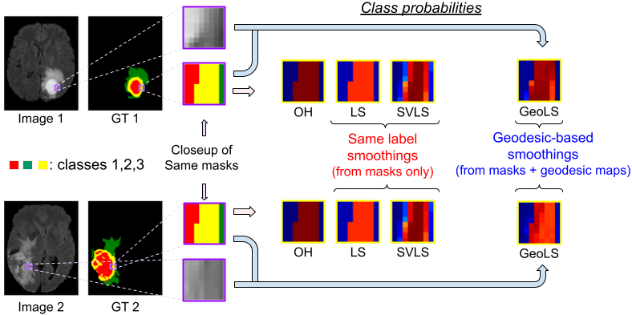

# <p align="center"> _GeoLS: Geodesic Label Smoothing for Image Segmentation_ <br />
## <p align="center"> _MIDL 2023, Oral Presentation_ [[paper](https://openreview.net/forum?id=mTIP1bkmR0q)] [[presentation](https://github.com/adigasu/GeoLS/blob/main/Files/MIDL2023_presentation.pdf)] [[poster](https://github.com/adigasu/GeoLS/blob/main/Files/MIDL2023_Poster.pdf)]

This repository contains an implementation of the Geodesic Label Smoothing (GeoLS) approach for Medical Image Segmentation. The proposed GeoLS integrates intensity variations into the label smoothing process by leveraging the geodesic distance transform. The resulting label assignment is based on the computed geodesic map, capturing class-wise relationships across two or more categories. Furthermore, spatial relationships are captured in the geodesic distance transform, integrating richer information than resorting to the Euclidean distance between pixels. 

**TL;DR:** Geodesic distance-based label smoothing for image segmentation, which captures the underlying image context.

<p align="center">  

**Keywords:** Image Segmentation, Geodesic Distance, Label Smoothing


## Dependencies
This code depends on the following libraries:

- GeodisTK
- python >= 3.8
- scikit-image
- SimpleITK
- torch >= 1.13.0
- torchvision >= 0.14.0

## Geodesic Maps
Install [Geodesic Distance Transform](https://github.com/taigw/GeodisTK) from :
```
pip install GeodisTK
```

Generate the normalized geodesic maps:
```python
python geodesic_maps.py --dataset=FLARE --num_classes=5 --input_dir="./FLARE/dataset" --output_dir="./FLARE/geodesic_maps"
```

## GeoLS loss

Load the normalized geodesic maps along with the dataset (inputs and targets) in the data loader of any segmentation network and use the geodesic maps in the loss function as below:

Example:
```python
criteria = CELossWithGeoLS(classes=5, alpha=0.1)  # For FLARE dataset having 5 classes
.
.
.
predictions = model(inputs)
loss = criteria(predictions, targets, geodesic_maps)
```

For 3D image segmentation (as in paper)

```python

class CELossWithGeoLS(torch.nn.Module):
    def __init__(self, classes=None, alpha=0.0):
        super(CELossWithGeoLS, self).__init__()
        '''
        classes: number of classes
        alpha: smoothing factor [0,1]. When alpha=0, it reduces to CE loss.
        '''
        
        self.alpha = alpha
        self.classes = torch.tensor(classes)
        self.class_indx = torch.arange(self.classes).reshape(1, self.classes).cuda()


    def forward(self, predictions, targets, geodesic_maps):
        '''
        predictions and geodesic_maps of dim: [B, C, S, H, W], whereas targets of dim: [B, S, H, W]
        (Batch: B, class: C, 3D image: S x H x W)
        geodesic_maps is normalized to [0,1]
        '''
        
        with torch.no_grad():
            oh_labels = (targets[...,None] == self.class_indx).permute(0,4,1,2,3)
            gls_labels = (1 - self.alpha) * oh_labels + self.alpha * geodesic_maps
        return (- gls_labels * F.log_softmax(predictions, dim=1)).sum(dim=1).mean()
```

For 2D image segmentation:
```python
class CELossWithGeoLS_2D(torch.nn.Module):
    def __init__(self, classes=None, alpha=0.0):
        super(CELossWithGeoLS_2D, self).__init__()
        '''
        classes: number of classes
        alpha: smoothing factor [0,1]. When alpha=0, it reduces to CE loss.
        '''
        
        self.alpha = alpha
        self.classes = torch.tensor(classes)
        self.class_indx = torch.arange(self.classes).reshape(1, self.classes).cuda()


    def forward(self, predictions, targets):
        '''
        predictions and geodesic_maps of dim: [B, C, H, W], whereas targets of dim: [B, H, W]
        (Batch: B, class: C, 2D image: H x W)
        geodesic_maps is normalized to [0,1]
        '''
        
        with torch.no_grad():
            oh_labels = (targets[...,None] == self.class_indx).permute(0,3,1,2)
            gls_labels = (1 - self.alpha) * oh_labels + self.alpha * geodesic_maps
        return (- gls_labels * F.log_softmax(predictions, dim=1)).sum(dim=1).mean()
```

## Reference
If you find this repo helpful for your work, please consider citing our work.
```
@inproceedings{vasudeva2023geols,
    title={Geo{LS}: Geodesic Label Smoothing for Image Segmentation},
    author={Sukesh Adiga Vasudeva and Jose Dolz and Herve Lombaert},
    booktitle={Medical Imaging with Deep Learning},
    year={2023}
}

```
